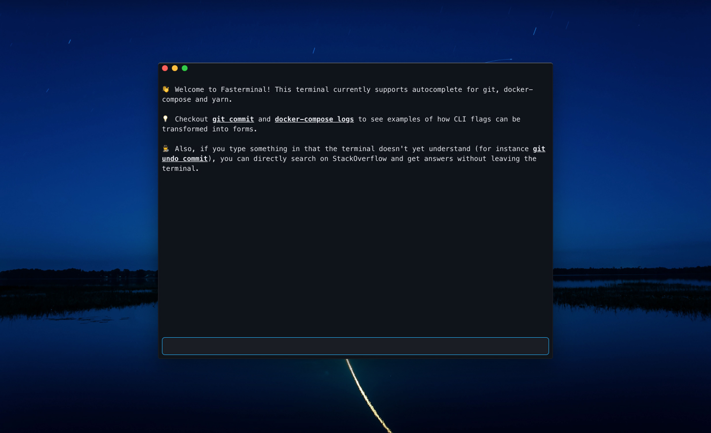

## Fasterminal

This is the result of a 48h Hackaton aimed at reimagining the Terminal app. One big problem with terminals is discovery. Using `man` or `--help` commands is just terrible UX. Unless you know exactly what you're doing, you're lost. Here is how Fasterminal tries to make this better:
* Show autocomplete suggestions for commands with more information
* Display CLI flags visually in forms to better show what's available
* Integrate with Stack Overflow to get questions answered directly in the Terminal

[Here is a short demo of this project](https://www.loom.com/share/ad2b31e0927449d78448c3a2b06d120c)

[Download the Mac app here](https://drive.google.com/file/d/1hthB1CNvwEs3v5dB9qMQDFkH0GCjgzkD/view?usp=sharing)

